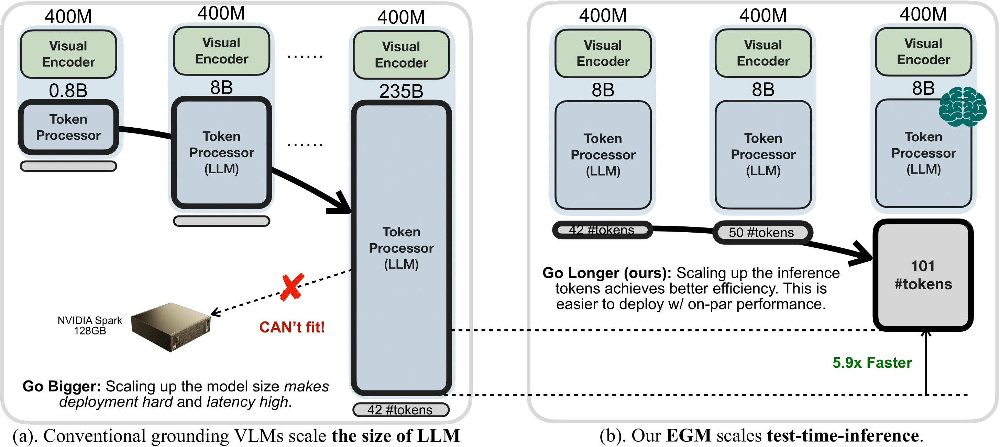
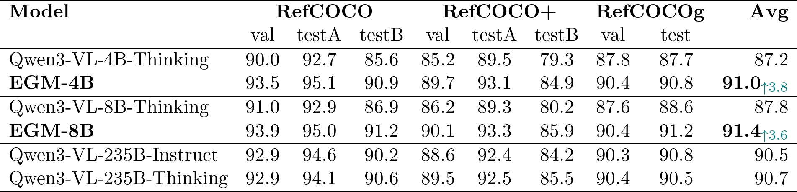

<h1 align="center">Bigger or Longer? Test-Time-Scaling is More Efficient<br> than Model-Size-Scaling for Visual Grounding  </h1>


This repository releases the official implementation of Bigger or Longer?Test-Time-Scaling is More Efficient than Model-Size-Scaling for Visual Grounding. 

这里差一个文章地址

## Abstract

Visual grounding is an essential capability of Visual Language Models (VLMs) to understand the real physical world. Previous state-of-the-art grounding visual language models tend to go bigger (scale the model size), which makes them very heavy for deployment and slow for inference, making it difficult to apply to edge systems to obtain grounding results in real time. However, we notice that the sizes of visual encoders are the same and they only scale the language parts. Small VLMs fall behind larger VLMs in grounding because of the difference in language understanding capability rather than visual information handling, and we thoroughly verify it. To mitigate the gap, we introduce *EGM*: a method to scale the test-time computation (*#generated tokens*) rather than the model sizes. Going longer is not only deployment-friendly, but also yields better end-to-end latency as the cost of each token is much cheaper. On the RefCOCO benchmark, our **EGM-8B** demonstrates **91.4 IoU** with average 737ms (**5.9$\times$ faster**) latency while **Qwen3-VL-235B** demands 4,320ms to achieve **90.5 IoU**. To validate our approach's generality, we further set up a new amodal grounding setting that requires the model to predict both the visible and occluded parts of the objects. Experiments show our method can consistently and significantly improve the vanilla grounding and amodal grounding capabilities of small models to be on par with or outperform the larger models, thereby improving the efficiency for visual grounding. 

See our website for more details : https://zgq1879.github.io/EGM_website/

### Table of Contents  <!-- omit in toc -->

  - [Bigger or Longer? Test-Time-Scaling is More Efficient than Model-Size-Scaling for Visual Grounding](#bigger-or-longer-test-time-scaling-is-more-efficient-than-model-size-scaling-for-visual-grounding-1)
  - [Dataset and Models](#dataset-and-models)
  - [SFT Training](#sft-training)
  - [RL Training](#rl-training)
  - [Evaluation](#evaluation)
  - [Acknowledgment](#acknowledgment)

## Bigger or Longer? Test-Time-Scaling is More Efficient than Model-Size-Scaling for Visual Grounding

### Motivation of the EGM method

Conventional VLMs **"Go Bigger"** (Left) by scaling up model size, which hinders deployment and latency. In contrast, our EGM **"Go Longer"** (Right) scales test-time inference instead; by outputting more tokens with a smaller model to bridge the understanding gap, we achieve on-par performance with significantly better efficiency.


<div align="center">
  
</div>

### Performance of the EGM method

Our **EGM** models (2B/4B/8B) demonstrate superior scaling efficiency compared to simply increasing model size ("Bigger"). Notably, **EGM-8B** outperforms the massive Qwen3-VL-235B-Instruct ('-I') and Thinking ('-T') models in accuracy, while respectively achieving significant **5.9×** and **18.9×** speedups in latency.

<div align="center">
  
</div>

The table below presents detailed results for EGM-4B and EGM-8B, comparing them against the baseline models as well as the Qwen3-VL-235B Instruct and Thinking variants:

<div align="center">
  
</div>

We provide RL model checkpoints for both [EGM-Qwen3-VL-4B-v1](https://huggingface.co/JamesZGQ/EGM-4B) and [EGM-Qwen3-VL-8B-v1](https://huggingface.co/JamesZGQ/EGM-8B). You may download these checkpoints and evaluate them following the instructions in the [Evaluation](#evaluation).

## Dataset and Models

You can download our datasets and models from HuggingFace using the commands below:

```bash
pip install -U huggingface_hub
hf download Qwen/Qwen3-VL-8B-Thinking --local-dir ./models/Qwen3-VL-8B-Thinking
hf download JamesZGQ/EGM_Datasets --local-dir ./data/EGM_Datasets
cat ./data/EGM_Datasets/coco.tar.part_* > ./data/EGM_Datasets/coco.tar
tar -xvf ./data/EGM_Datasets/coco.tar -C ./data/
tar -xvf ./data/EGM_Datasets/coco_flip.tar -C ./data/
```


If you wish to directly use our pre-trained EGM-Qwen3-VL-8B-SFT model for development, use the following command to download it. Afterward, please refer to the [RL Training](#rl-training) section for training instructions.

```bash
hf download JamesZGQ/EGM-8B-SFT --local-dir ./models/EGM-8B-SFT
```

**Note**: If you are prohibited from the internet, please try to use the HF Mirror:

```bash
export HF_ENDPOINT=https://hf-mirror.com
```

## SFT Training

Run the following commands to create the environment for SFT training:

```bash
git clone https://github.com/zgq1879/EGM.git
cd EGM
conda create -n EGM-sft -y -c nvidia/label/cuda-12.4.0 -c nvidia -c conda-forge python=3.9 cuda-toolkit=12.4
conda activate EGM-sft
pip install -r sft/requirement_sft.txt
```

To train the EGM-Qwen3-VL-8B-SFT model, execute the following commands:

```bash
export BASE_DIR=$(cd .. && pwd)
export REFCOCO_ANNOTATION_PATH="${BASE_DIR}/data/EGM_Datasets/vanilla_grounding_reasoning_training_dataset_cot_subset.jsonl"
export REFCOCO_DATA_PATH="${BASE_DIR}/data/"
export OUTPUT_DIR="${BASE_DIR}/models/EGM-8B-SFT"


cd sft/qwen-vl-finetune
bash scripts/sft_qwen3_8b_grounding.sh
```

We have provided a 1k subset `vanilla_grounding_reasoning_training_dataset_cot_subset.jsonl` here solely as an example for SFT. For further details on full SFT data construction and training other models, please refer to`sft/README.md`.

## RL Training

We provide the Grounding training and inference workflow for the **EGM-8B** model as the primary example below.

### 1. Installation

```bash
git clone https://github.com/zgq1879/EGM.git
cd EGM
conda create -n EGM-rl python=3.11.13
conda activate EGM-rl
pip install -r requirement.txt
```
<!-- 安装部分有两个问题需要check，一个是我们这边的机器只能用docker启动，启动以后没有办法安装cuda配置，所以我后面使用了一个pytorch/pytorch:2.8.0-cuda12.9-cudnn9-devel作为基础镜像测试，因此最理想的情况下是有一台公开的conda机器可以重新测试一下
此外我这边连接不了外网因此flash-attn也需要测试一下https://github.com/Dao-AILab/flash-attention/releases/download/v2.8.3/flash_attn-2.8.3+cu12torch2.8cxx11abiFALSE-cp311-cp311-linux_x86_64.whl能不能正常安装 -->


<!-- ### 3. Data Preparation

Please download the training and testing datasets before proceeding.

[Training annotations](https://huggingface.co/datasets/JamesZGQ/EGM_Datasets/tree/main/train_data) |
[Testing annotations](https://huggingface.co/datasets/JamesZGQ/EGM_Datasets/tree/main/eval_data) |
[Images tar1](https://huggingface.co/datasets/JamesZGQ/EGM_Datasets/blob/main/coco.tar) |
[Images tar2](https://huggingface.co/datasets/JamesZGQ/EGM_Datasets/blob/main/coco_flip.tar)

```bash
# Set your environment variables
export BASE_IMG_PATH=${YOUR_BASE_IMG_PATH}
export OUTPUT_DIR=${YOUR_DATA_DIR}
export VAL_DIR=${YOUR_VAL_DIR}
export TRAIN_JSON=${QWEN3_8B_GROUNDING_TRAIN_JSON}

# Run preprocessing scripts
bash examples/data_preprocess/grounding_val.sh
bash examples/data_preprocess/grounding_all.sh
``` -->


### 4. Training

Reinforcement Learning is conducted based on the SFT checkpoint. The default configuration utilizes 8 GPUs. You may customize the distributed training settings via the `trainer.nnodes` and `trainer.n_gpus_per_node` arguments. 

We provide the necessary training and validation sets in Parquet format for EGM-Qwen3-VL-8B-v1. Please use the following code to replace the relative image paths within the Parquet files:

```bash
export BASE_DIR=$(pwd)
python EGM/verl/scripts/replace_img_dir.py \
  --parquet_path ./data/EGM_Datasets/processed_rl_data/train_grounding.parquet  \
  --base_img_root ${BASE_DIR}/data/
python EGM/verl/scripts/replace_img_dir.py \
  --parquet_path ./data/EGM_Datasets/processed_rl_data/val_grounding.parquet  \
  --base_img_root ${BASE_DIR}/data/
```


Alternatively, you may construct the datasets manually using `verl/examples/data_preprocess/grounding_all.sh` and`verl/examples/data_preprocess/grounding_val.sh`.


To initiate training, execute the script below from within the `/EGM` directory:

```bash

# Configure Weights & Biases (W&B) for experiment tracking
export WANDB_BASE_URL=${YOUR_WANDB_BASE_URL}   
export WANDB_API_KEY=${YOUR_WANDB_API_KEY} 


export BASE_DIR=$(cd .. && pwd)
export MODEL_PATH="${BASE_DIR}/models/EGM-8B-SFT"
export OUTPUT_DIR="${BASE_DIR}/checkpoint/"
export DATA_DIR="${BASE_DIR}/data/EGM_Datasets/processed_rl_data/"

cd verl
bash scripts/grounding_qwen.sh
```

<!-- ### 6. Handling Environment Issues

1. If you encounter runtime errors related to FlashInfer, such as `GLIBC_2.32' not found (required by .../flashinfer/.../sampling.so)`, you can work around this by disabling the FlashInfer sampler: set the environment variable `VLLM_USE_FLASHINFER_SAMPLER=0` or `SGLANG_IS_FLASHINFER_AVAILABLE=false` before launching the training or inference command. -->

## Evaluation

You may download the model for evaluation using the following command:

```bash
hf download JamesZGQ/EGM-8B --local-dir ./models/EGM-8B
```

To evaluate the model, install `sglang` with `pip install sglang==0.5.6` and use the command provided below.

**Note:** The RefCOCO benchmark consists of eight distinct JSON files. Consequently, you must run the evaluation script sequentially for each of the 8 files to obtain the complete benchmark results.

The following example demonstrates evaluation using `refcoco+_testA.jsonl:`

```bash
export BASE_DIR=$(pwd)
export MODEL_PATH="${BASE_DIR}/models/EGM-8B"
export DATA_JSON="${BASE_DIR}/data/EGM_Datasets/metadata/eval/refcoco+_testA.jsonl"
export OUTPUT_DIR="${BASE_DIR}/result/"
export BASE_IMG_DIR="${BASE_DIR}"

cd EGM/verl/
bash scripts/sglang_infer.sh
```

We also support evaluation with vLLM:

```bash
export BASE_DIR=$(pwd)
export MODEL_PATH="${BASE_DIR}/models/EGM-8B"
export DATA_JSON="${BASE_DIR}/data/EGM_Datasets/metadata/eval/refcoco+_testA.jsonl"
export OUTPUT_DIR="${BASE_DIR}/result/"
export BASE_IMG_DIR="${BASE_DIR}"

cd EGM/verl/
bash scripts/vllm_infer.sh
```

## Acknowledgment

This repository benefits from [Qwen3VL](https://github.com/QwenLM/Qwen3-VL), [InternVL](https://github.com/OpenGVLab/InternVL), [verl](https://github.com/volcengine/verl) and [verl-internvl](https://github.com/Weiyun1025/verl-internvl).

Thanks for their wonderful works and their efforts to further promote LLM research.

---

